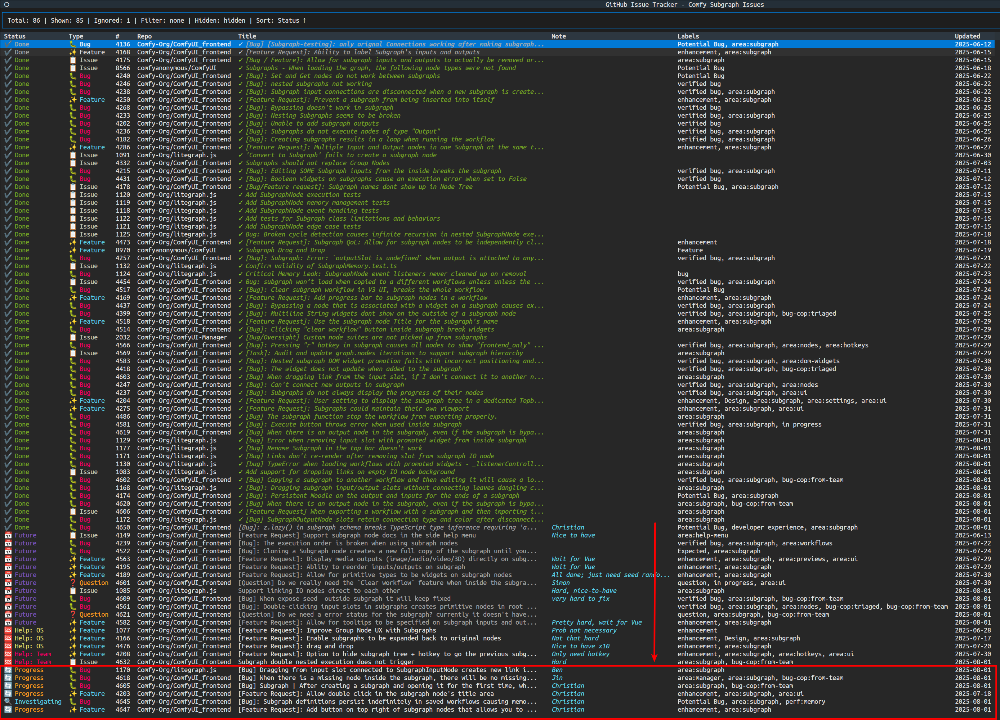

# GitHub Issue Tracker



## ✨ Features

- 📋 **YAML Templates**: Reusable query configurations for complex issue filtering
- 🔍 **Advanced Filtering**: Multiple condition types (labels, title/body text, authors, dates)
- 📁 **Multi-Repository**: Track issues across multiple repositories simultaneously
- 💬 **Discussions Support**: Include GitHub Discussions alongside issues
- 🎨 **Smart Classification**: Automatic color-coding for bugs, features, questions
- 🏷️ **Custom Status**: Track progress with custom statuses (in progress, blocked, future)
- 📝 **Notes System**: Add persistent notes to any issue
- 🚫 **Issue Management**: Hide/ignore irrelevant issues
- 🔧 **Runtime Configuration**: Modify filters without editing YAML files
- 💾 **Persistent State**: All changes automatically saved to templates
- 🌐 **Browser Integration**: Open issues directly in your browser
- 📊 **Template Manager**: Visual template selection with usage tracking
- ⚡ **GitHub CLI Integration**: Faster data fetching when available

## 🚀 Installation

### Option 1: From Source

```bash
git clone https://github.com/[username]/github-issue-tracker.git
cd github-issue-tracker
python -m venv venv
source venv/bin/activate  # On Windows: venv\Scripts\activate
pip install -e .
```

### Option 2: Using pip (when published)

```bash
pip install github-issue-tracker
```

## ⚙️ Setup

### 1. Authentication

The application supports multiple authentication methods:

**GitHub CLI (Recommended)**:

```bash
gh auth login
```

**Environment Variable**:

```bash
export GITHUB_TOKEN="your-personal-access-token"
```

**Token Requirements**: `repo` scope for private repositories, or `public_repo` for public only.

### 2. Create Your First Template

```bash
mkdir templates
# See template format below
```

## 🏃‍♂️ Usage

### Basic Usage

```bash
# Launch template selector
python -m github_issue_tracker

# Use specific template
python -m github_issue_tracker templates/my-template.yaml
```

### Keyboard Shortcuts

#### Main View

- `↑/↓` - Navigate issues
- `Enter` - Open issue in browser
- `i` - Toggle ignore/unignore issue
- `n` - Edit note for current issue
- `s` - Cycle status (none → in progress → blocked → future)
- `f` - Filter by text
- `c` - Configure filters (state, discussions)
- `h` - Toggle showing hidden/ignored issues
- `w` - Save changes to YAML file
- `r` - Refresh issues from GitHub
- `q` - Quit

#### Template Selection

- `↑/↓` - Navigate templates
- `Enter` - Select template
- `r` - Refresh template list
- `q` - Quit

## Template Format

```yaml
name: "Query Name"
description: "Description of this query"

repositories:
  - owner: "org-name"
    repo: "repo-name"

conditions:
  - type: "label"
    value: "bug"
  - type: "title_contains"
    value: "error"
    case_sensitive: false

state: "open" # open, closed, all
include_discussions: true # Fetch GitHub discussions

ignored_issues: [] # Issue numbers to ignore
notes: {} # Issue number -> note mapping
status_overrides: {} # Issue number -> status mapping
```

### Condition Types

- `label` - Has specific label
- `title_contains` - Title contains text
- `body_contains` - Body contains text
- `author` - Created by specific user
- `assignee` - Assigned to specific user
- `created_after` - Created after date (ISO format)
- `updated_after` - Updated after date (ISO format)

Conditions can be negated with `negate: true`.

### Issue Type Detection

Issues are automatically color-coded based on:

1. Labels: `bug`, `feature`, `enhancement`, `question`
2. Title patterns: `[bug]`, `[feature]`, `[question]`
3. Discussions are marked separately

### Runtime Configuration

Press `c` to open the filter configuration where you can:

- Toggle between open/closed/all issues
- Enable/disable discussions
- Save current view as a new template

### Template Selection

When launched without arguments, shows all templates sorted by last usage. Templates are stored in the `templates/` directory.
